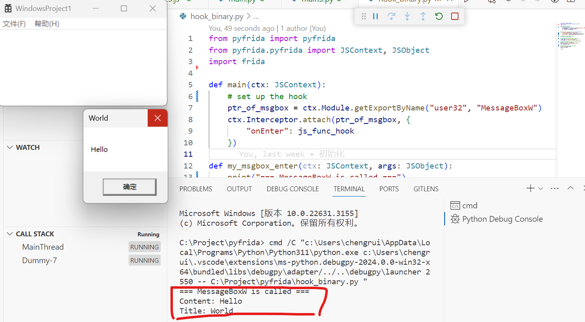
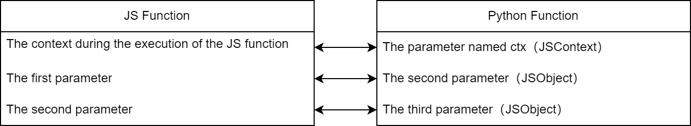

## Breaking Barriers: PyFrida's Simplified Pythonic Approach to Frida Scripting

### Abstract
Frida is a widely-used binary instrumentation framework. When using Frida, the typical workflow involves writing Frida scripts in JS and injecting them into the target process using frida-tools or Frida's python bindings. This workflow presents several inconveniences, such as:
* Inability to debug Frida scripts in real-time.
* Integration of Frida scripts into projects requires mechanisms like RPC or Socket.
* In the binary security field, Python is more popular than JS, which many users must familiarize themselves with before starting to write Frida scripts.

To address these issues, we developed the PyFrida framework, enabling Frida scripts to be written in Python. It works by implementing a virtual machine in JS and dynamically converting Python code into a sequence of instructions to execute on the virtual machine. With PyFrida, users can write and debug Frida scripts in Python and easily integrate them into Python projects.

### Quick Start
In this example, we set up a hook within the main function. This hook intercepts the MessageBoxW function from the user32.dll. The callback function for this hook is named my_msgbox_enter. It prints out the message and title parameters passed to MessageBoxW. The methods used to set up this hook, Module.getExportByName and Interceptor.attach, as well as readUtf16String for reading parameters, are the same as those in the Frida JS API. In pyfrida, you can access and use all the Frida JS APIs.

```python
from pyfrida import pyfrida
from pyfrida.pyfrida import JSContext, JSObject
import frida

def main(ctx: JSContext):
    # set up the hook
    ptr_of_msgbox = ctx.Module.getExportByName("user32", "MessageBoxW")
    ctx.Interceptor.attach(ptr_of_msgbox, {
        "onEnter": js_func_hook
    })

def my_msgbox_enter(ctx: JSContext, args: JSObject):
    print("=== MessageBoxW is called ===")
    print("Content:", args[1].readUtf16String().get_val())
    print("Title:", args[2].readUtf16String().get_val())

# create the frida script object
fs = pyfrida.FridaScript()

# bind the python function to js function
js_func_main = fs.add_js_function(main)
js_func_hook = fs.add_js_function(my_msgbox_enter)

# create the process and inject the frida script
device = frida.get_local_device()
pid = device.spawn("./WindowsProject1.exe")
fs.attach(device, pid)

# execute the main func to start hook
fs.exec_func(js_func_main)
device.resume(pid)

input()
```

The result of running the aforementioned code is shown in the following image. After the MessageBoxW is called, the calling parameters are successfully printed.




In order to thoroughly understand the above code, it is necessary to first understand three key concepts: the add_js_function method (which binds Python functions to JavaScript functions), the ctx parameter (which provides access to the JavaScript environment), and the get_val method (which converts JavaScript objects within the JavaScript environment into Python objects). The following will introduce these concepts.

#### Binding Python Functions to JavaScript Functions

The above code first involves `fs = pyfrida.FridaScript()`. This line of code creates a pyfrida script that allows us to add **bindings between JS functions and Python functions** to the pyfrida script, as well as to actively execute a particular function. Since pyfrida is based on the method of defining a virtual machine in JS, the concept of **binding relationships** was introduced. As shown in the figure below, a Python function can be bound to a JavaScript function. Each Python function must have ctx (JSContext type) as its first parameter, representing the context when executing the corresponding JS function. The Python function also needs to have additional arguments (JSObject) to receive the parameters from the JS function. Whenever a JS function is called, whether it is actively called or passively called as a callback, the associated Python function will be invoked, and all behaviors of the Python function, such as return values, will be reflected in the JS function. In the code mentioned, we first define a main function and add a binding to the pyfrida script with `js_func_main = fs.add_js_function(main)`. If you want to refer to this function in the pyfrida script in the future, you will need to use `js_func_main`.



#### Accessing the JS Environment
In the aforementioned code, after injection is carried out, the hook is set up by executing the main function through a call to fs.exec_func(js_func_main). Within the main function, any references to the JS environment must be made via the ctx parameter. The main function obtains the address of MessageBoxW by invoking the getExportByName method within the JS environment and sets up the hook by invoking the attach method. When setting up the hook, pay attention to the **"onEnter": js_func_hook**. If there is confusion about why it is js_func_hook instead of my_msgbox_enter, please review the binding relationship discussed in the previous section.

#### Converting between JS objects and Python objects
In the function my_msgbox_enter, the code to read the argument string is args[1].readUtf16String().get_val(). The method readUtf16String is part of the Frida JS API; the subsequent get_val method pertains to the issue of converting between JS objects (JSObject) and Python objects. The readUtf16String method returns a JS object which exists within the JS environment and not in the current Python environment. Hence, the get_val method is employed using serialization/deserialization to convert it into a Python object. Currently, the get_val method supports converting strings, integers, floats, booleans, arrays, dictionaries, and other types from the JS environment to Python objects. PyFrida also allows for some implicit conversions; obviously, if one needs to access the JS environment, such as invoking a function therein, Python objects need to be converted into JS objects. This conversion happens implicitly when calling the attach method within the main function for the second parameter, which gets converted from a Python object into a JS object. In addition to the get_val method, one could also use the get_str method, which provides a JSON representation of the JS object.

### HOOK Java Methods
This is an example of HOOKing Java methods, which is essentially the same as the previous example. The only thing to note is that when executing the main function to deploy the hook, the **exec_func_in_java** method is called.

```python
from pyfrida import pyfrida
from pyfrida.pyfrida import JSContext, JSObject
import frida

def main(ctx: JSContext):
    clz = ctx.Java.use("com.kanxue.pediy1.MainActivity$1")
    clz.onClick.implementation = js_func_hook

def hook_click(ctx: JSContext, arg: JSObject):
    print("=== onclick is called ===")
    result = ctx.this.onClick(arg)
    print("arg:", arg.get_val())
    print("return value:", result.get_str())

fs = pyfrida.FridaScript()

js_func_main = fs.add_js_function(main)
js_func_hook = fs.add_js_function(hook_click)

frida.get_usb_device()
device = frida.get_usb_device()
pid = device.get_process("pediy1").pid
fs.attach(device, pid)

fs.exec_func_in_java(js_func_main)

input()
```

### Framework Design
The core code of the virtual machine on JS is as follows: simply put, it waits for instructions, executes them, and then sends back the results upon completion. Additionally, overload some operators for the JSObject class in Python, and implement the generation and execution of virtual machine instructions within these overloaded operators. Note that I intentionally extracted the instruction interpretation process of the virtual machine from the callback function and placed it in VMEntry. This is to avoid some special cases, such as when hooking into Java methods that call the original method. If the call is made inside the callback function, it may lead to the call originating from another thread, which could cause some issues.

```js
function VMEntry(vmi) {
    var stack = vms[vmi].stack
    var opcode, args
    var flag = true
    var return_val = 0
    while (flag) {
        const op = recv("vm", function (msg) {
            opcode = msg["opcode"]
            args = msg["args"]
        })
        op.wait()
        if (opcode == 0) {
            // evalJsInStack
            try {
                send({"type": "vm", "val": evalJsInStack(args[0], vmi), "vmi": vmi})
            }
            catch(e) {
                send({"type": "vm", "err": String(e), "vmi": vmi})
            }
        }
        else if (opcode == 1) {
            // evalJs
            try {
                send({"type": "vm", "val": evalJs(args[0]), "vmi": vmi})
            }
            catch(e) {
                send({"type": "vm", "err": String(e), "vmi": vmi})
            }
        }
        else if (opcode == 2) {
            // exitVM
            flag = false
            return_val = exitVM(vmi, args[0])
        }
    }
    return return_val
}
```

### Future Work
At present, this tool is still of an experimental nature and has many shortcomings that need to be improved. For example, the current implementation of the virtual machine has a performance bottleneck because every execution of a virtual machine instruction requires an I/O synchronization. Additionally, there are problems with the current level of encapsulation. It still remains at the virtual machine level, preserving concepts like the JS environment and the Python environment. Functionality is provided through invoking the Frida JS API within the JS environment. There should be a move towards a higher level of encapsulation, trying to wrap the Frida JS API directly into a Python API, and abandoning the distinction between JS and Python environments.
